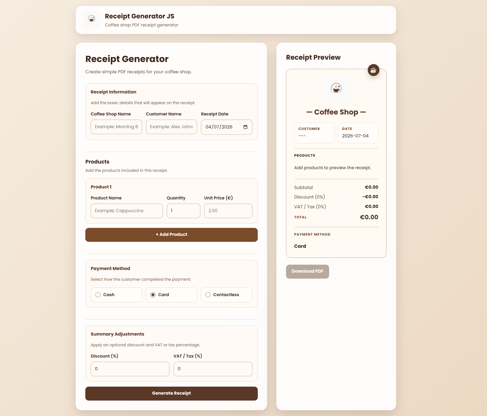

# ☕ Receipt Generator JS

A modern web application built with Vanilla JavaScript that allows coffee shops to create professional receipts with live preview and PDF export.

<p align="center">
  
</p>


---

## 📑 Table of Contents

- [Demo](#-demo)
- [Screenshots](#-screenshots)
- [Features](#-features)
- [Tech Stack](#-tech-stack)
- [Project Structure](#-project-structure)
- [Installation](#-installation)
- [Usage](#-usage)
- [Project Roadmap](#-project-roadmap)
- [Why I Built This](#-why-i-built-this)
- [What I Learned](#-what-i-learned)
- [Future Improvements](#-future-improvements)
- [Author](#-author)
- [License](#-license)

---

## 🚀 Demo

**Live Demo**

> https://fernandoferreira20.github.io/receipt-generator-js/

*(Available after GitHub Pages deployment.)*

---

## 📸 Screenshots

### Application


### Receipt Preview


### Generated PDF


---

## ✨ Features

- ✅ Live receipt preview
- ✅ Coffee shop branding
- ✅ Dynamic coffee shop name
- ✅ Multiple product cards
- ✅ Automatic subtotal and total calculation
- ✅ Discount support
- ✅ VAT / Tax calculation
- ✅ Payment method selection
- ✅ Professional receipt numbering
- ✅ PDF export with branded layout
- ✅ Responsive interface
- ✅ Built with Vanilla JavaScript

---

## 🛠️ Tech Stack


---

## 📂 Project Structure

```text
receipt-generator-js/
├── assets/
│   ├── icons/
│   │   └── Logo.png
│   └── images/
├── css/
│   └── style.css
├── docs/
│   └── screenshots/
├── js/
│   └── script.js
├── index.html
└── README.md
```

---

## 🚀 Installation

Clone the repository:

```bash
git clone https://github.com/fernandoferreira20/receipt-generator-js.git
```

Move into the project directory:

```bash
cd receipt-generator-js
```

Run the application using **Live Server** or simply open `index.html` in your browser.

---

## 📖 Usage

1. Enter the coffee shop information.
2. Add one or more products.
3. Select the payment method.
4. Configure Discount and VAT / Tax if required.
5. Click **Generate Receipt** to validate and save the receipt.
6. Click **Download PDF** to export the receipt.

---

## 🗺️ Project Roadmap

### ✅ Version 1.0

- [x] Live receipt preview
- [x] Coffee shop branding
- [x] Dynamic coffee shop name
- [x] Multiple products
- [x] Dynamic product cards
- [x] Automatic total calculation
- [x] Discount support
- [x] VAT / Tax calculation
- [x] Payment method selection
- [x] Professional receipt numbering
- [x] PDF generation
- [x] Logo integration
- [x] Responsive interface

### 🚀 Version 2.0

- [ ] Receipt history
- [ ] Print mode
- [ ] Multiple currencies
- [ ] Multiple languages
- [ ] Dark mode
- [ ] Custom logo upload
- [ ] Local Storage
- [ ] Backend API
- [ ] User authentication

---

## 💡 Why I Built This

This project was created to strengthen my JavaScript, HTML and CSS skills by developing a practical web application inspired by a real coffee shop workflow.

The main objective was to improve my understanding of DOM manipulation, event-driven programming, project organization, and PDF generation while following a clean Git and GitHub workflow.

---

## 📚 What I Learned

During this project I improved my understanding of:

- DOM manipulation
- Event-driven programming
- Dynamic UI rendering
- Arrays and Objects
- JavaScript functions
- Responsive layouts
- PDF generation with jsPDF
- Code organization
- Git workflow
- GitHub workflow

---

## 🔮 Future Improvements

- Receipt history
- Print-friendly receipts
- Custom company logo upload
- Multiple currencies
- Multiple languages
- Dark mode
- Local Storage
- Backend integration

---

## 👨‍💻 Author

**Fernando Ferreira**

GitHub:
https://github.com/fernandoferreira20

---

## 📄 License

This project is licensed under the **MIT License**.

---

⭐ If you found this project interesting, feel free to leave a star or fork the repository.

Built with **HTML5**, **CSS3** and **Vanilla JavaScript**.